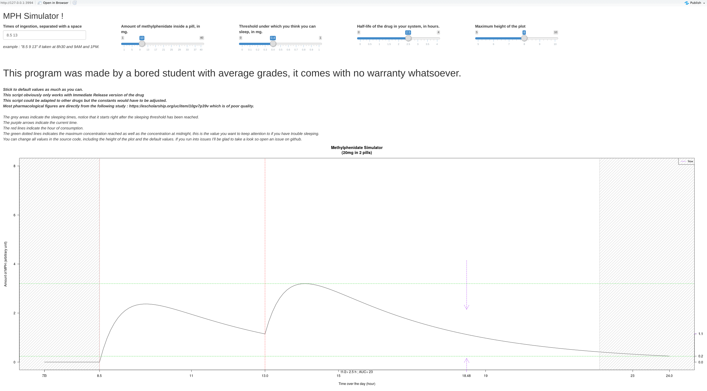
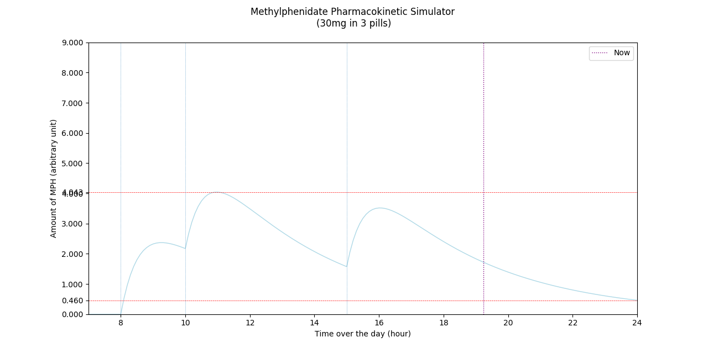

# Med-pharmacokinetic-simulator
## What is this? What does it do?
This simple R code use the package `Shiny` to simulate the pharmacokinetic of methylphenidate immediate release tablets throughout the day. It was primarily designed to help a friend sleep at night and optimize his schedule.  It can be adapted to other drugs if you find the right pharmacokinetic parameters. Also this code (sort of) exists in Python as I tried first with it. To see examples of it running, please look at the gifs below.

*keywords : ADHD, ADD, attention deficit, hyperactivity*

## Notes:

* Made by a bored student, no warranty whatsoever
* I made it for a friend so I can't provide any assistance regarding symptoms, dosage, etc
* Don't hesitate to open an issue if you have **any** question, I'll always take a look
* If you find any typo or error let me know, criticism is **very** welcome.
* All values are from this (*somewhat poor quality*) study  https://escholarship.org/uc/item/9gv7p39v so don't hesitate to tune the parameters to your liking.
* My friend also used the FOSS app [diary](https://github.com/billthefarmer/diary) on his android phone to register his weight and all his drug usage (mg, hour taken etc) so I also did a bit of code to help him import his data into an R database. It's in this repository.
* This repository is licensed

## Usage
### In R
* download the latest .R file from this page.
* open it with RStudio (development environment for R language programming, obviously free)
* make sure Shiny is installed : type `install.packages("shiny")` inside the R console, this will install Shiny, a package allowing nice app like display with dynamic updating.*
* run the code and adjust the value appearing on screen.
### In python 
* run the code, but it's not as polished
* it should only require matplotlib

## In action:
### R
#### gif

#### Picture

### Python

